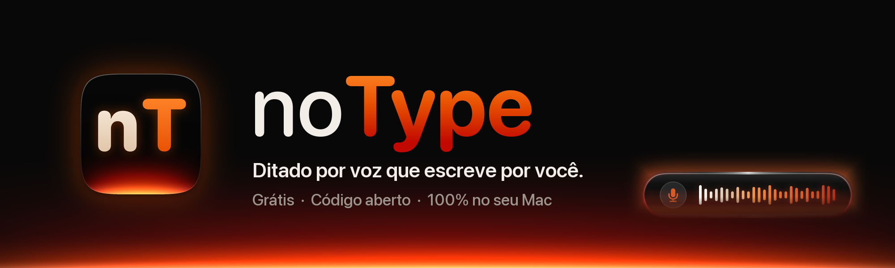
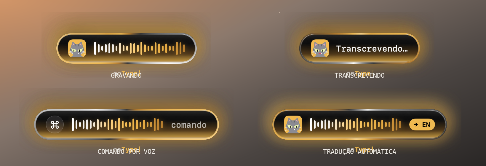
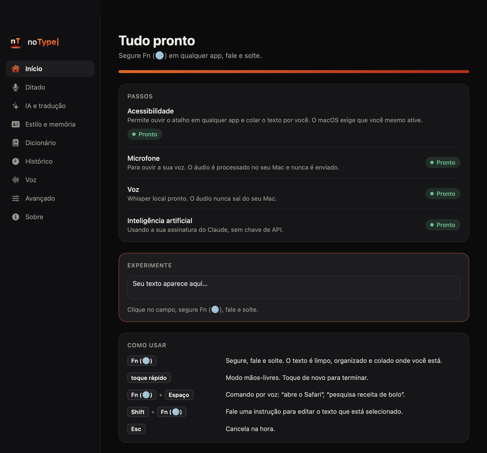
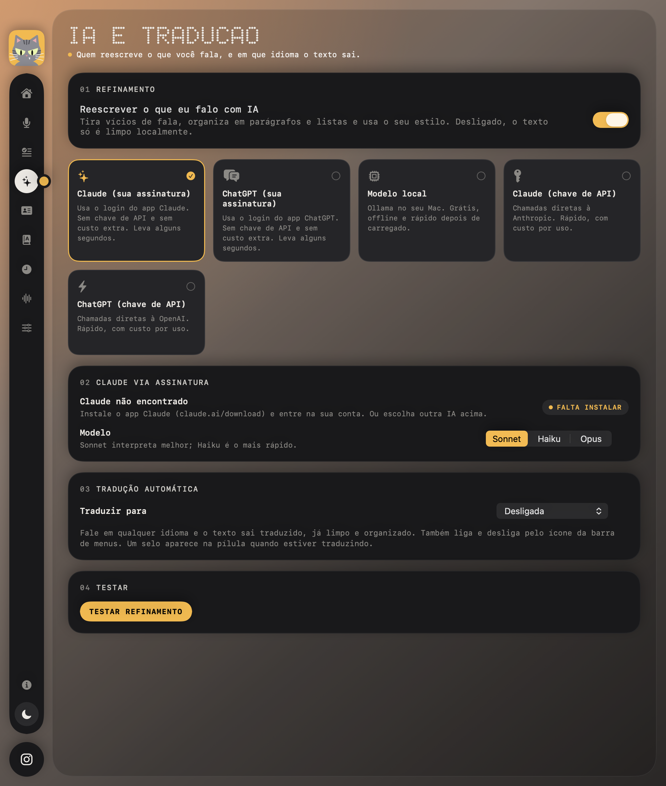
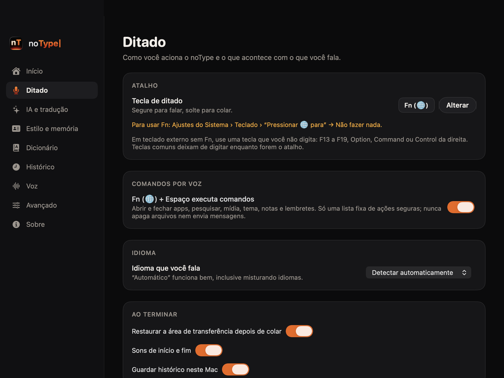

<p align="center">
  
</p>

<p align="center">
  <a href="https://github.com/odaniribeiro/notype/releases/latest"></a>
  
  
  
  
</p>

<p align="center">
  <b>Ditado por voz para Mac que escreve por você.</b><br>
  Segure uma tecla, fale, solte. O texto aparece no app em que você está,<br>
  já limpo, organizado em parágrafos e listas, e escrito do seu jeito.
</p>

<p align="center">
  <a href="https://github.com/odaniribeiro/notype/releases/latest"><b>⬇ Baixar para Mac</b></a>
  &nbsp;·&nbsp; <a href="#como-instalar">Como instalar</a>
  &nbsp;·&nbsp; <a href="https://www.vakinha.com.br/6366411">Apoiar o projeto</a>
</p>

---

## Veja em ação

A pílula que aparece enquanto você usa, em cada momento:

<p align="center"></p>

E a janela do app, no visual da família: trilho de ícones, cartões foscos, títulos em pontos e a **Paçoca**, a gata mascote, que pisca e acompanha o mouse. Tem tema escuro e claro (alternador no trilho). Na primeira abertura ela mostra só o que falta:

<p align="center"></p>

<details>
<summary>Mais telas</summary>

<p align="center">
  
  
</p>

</details>

## O que ele faz

| | |
|---|---|
| **Ditado** | Segure a tecla, fale, solte. Tira "né", "tipo", repetições e autocorreções, pontua, separa em parágrafos e vira lista quando você enumera. |
| **Tom por app** | Reconhece onde você está (chat, e-mail, notas…) e ajusta o registro. |
| **Seu estilo** | Aprende como você fala e escreve e usa isso nas próximas falas. O perfil fica numa pasta sua. |
| **Tradução** | Fale em um idioma, o texto sai em outro (12 idiomas), ligado e desligado pela barra de menus. |
| **Comandos por voz** | Tecla + Espaço: "abre o Safari", "pesquisa receita de bolo", "próxima música", "cria uma nota…". |
| **Editar por voz** | Selecione um texto, Shift + tecla, diga "deixa mais formal". |
| **Transcrever áudio e vídeo** | Solte um MP3 ou cole um link do YouTube: o noType transcreve no seu Mac, sem limite de duração, e copia em JSON compacto para você colar na sua IA (cortes, resumos, posts). |
| **Qualquer tecla** | Fn, F13 a F19, Option, Command ou Control da direita. Serve para teclado externo. |
| **Atualiza sozinho** | Avisa quando sai uma versão nova e gratuita, e atualiza com um clique. |

## Transcrever áudio e vídeo

Na aba **Transcrever** você solta um arquivo (MP3, M4A, WAV, MP4, MOV) ou cola um link (YouTube e outros sites) e o noType transcreve no seu Mac, **sem limite de duração**. O idioma é detectado por vários pontos do áudio, e dá para escolher à mão. O resultado sai com os tempos e você copia como:

- **JSON compacto para IA**, no formato `[início_em_segundos, "texto"]`, o mais curto possível para colar numa IA e pedir cortes, resumos ou posts;
- texto com tempos, só o texto, ou salva em `.json`, `.txt` e legenda `.srt`.

As transcrições ficam salvas em **Documentos/noType/Transcricoes**. Na primeira vez com link, o app baixa sozinho um componente que lê os sites (cerca de 37 MB). Use só conteúdo que você tem o direito de usar.

## Como instalar

1. Baixe o **`noType-x.y.z.dmg`** na [página de versões](https://github.com/odaniribeiro/notype/releases/latest).
2. Abra o arquivo e **arraste o noType para Aplicativos**.
3. Abra o noType. **Na primeira vez**, o macOS pode avisar que não conhece o desenvolvedor. Clique com o **botão direito** no app › **Abrir** › **Abrir**. Só é preciso uma vez.
4. O noType prepara tudo sozinho (motor e modelo de voz, ajuste da tecla Fn e a IA que já estiver no seu Mac). Você só libera duas permissões do macOS (Acessibilidade e Microfone) e escolhe como a IA vai funcionar, se ele ainda não tiver achado uma.

Se o macOS insistir em bloquear, rode no Terminal:

```bash
xattr -dr com.apple.quarantine /Applications/noType.app
```

## O que você precisa

- **Mac com chip Apple (M1 ou mais novo)** e **macOS 14 ou superior**.
- Uma IA para reescrever o texto (qualquer uma; sem nenhuma, o texto sai só limpo, sem reescrita):

| Opção | Como fica |
|---|---|
| **Claude pela sua assinatura** | Com o [app Claude](https://claude.ai/download) instalado e com login feito, o noType usa sozinho. Sem chave de API. |
| **ChatGPT pela sua assinatura** | Com o [app ChatGPT](https://openai.com/chatgpt/mac/) instalado e com login feito, é só escolher em *IA e tradução*. |
| **IA local grátis** | Um clique em *Instalar IA local grátis*: o noType baixa e prepara tudo (cerca de 5 GB, uma vez). Funciona sem internet. |
| **Chave de API** | Se preferir usar uma chave própria. |

**Cada pessoa usa a própria conta.** O noType não tem servidor, conta nem chave própria: ele só conversa com os aplicativos que já estão no seu Mac, usando o seu login. O uso conta no seu plano, e a sua senha fica com o app da empresa correspondente, nunca com o noType.

## Privacidade

- **O áudio nunca sai do seu Mac.** A transcrição é feita localmente.
- **Só o texto** do que você falou vai para a IA que você escolheu. Com a IA local, nada sai do computador.
- Não há conta, telemetria nem servidor do noType. Além da IA que você escolher, o app usa a rede só para: **ver se há uma versão nova** nesta página (só uma leitura; nada seu é enviado; dá para desligar em *Avançado › Atualizações*), **baixar o modelo de voz** uma vez, e **baixar o áudio de um link** quando você pedir em *Transcrever*.
- Chaves de API, se você usar, ficam no **Keychain** do macOS.
- Seu histórico e o perfil de estilo ficam em **Documentos/noType**. Você pode ler, editar ou apagar tudo em *Ajustes › Estilo e memória*.
- Comandos por voz executam só uma **lista fixa de ações seguras**: nunca apagam arquivos, enviam mensagens nem rodam comandos livres.

## Atualizações

O noType avisa sozinho quando sai uma versão nova e **gratuita**: uma notificação do macOS, um aviso no topo da janela e uma bolinha no ícone da barra de menus. Com um clique em **Atualizar agora** ele baixa, confere a integridade, troca o app e reabre. Nada acontece sem o seu clique.

> Como as versões não têm a assinatura paga da Apple, depois de atualizar o macOS pode pedir de novo a permissão de Acessibilidade. O assistente de início mostra o botão **Ativar**.

## Limites conhecidos

- **Só Macs com chip Apple.** Mac com processador Intel não é compatível.
- **Não está na Mac App Store**: o app precisa de Acessibilidade e de atalho global, o que a App Store não permite.
- A aba **Transcrever** lê MP3, M4A, WAV, MP4 e MOV. Formatos como ogg, opus e webm só funcionam se você tiver o `ffmpeg` instalado. Alguns links (vídeos privados ou que pedem login) não podem ser baixados.
- O modo "IA pela assinatura" leva alguns segundos por ditado. A IA local ou uma chave de API costumam ser mais rápidas.
- Volume por voz só funciona em saídas de áudio com controle por software (não em HDMI e alguns dispositivos).

## Problemas e sugestões

Encontrou algo estranho ou tem uma ideia? Abra uma **issue** aqui no GitHub descrevendo o que aconteceu.

## Apoie o projeto

O noType é gratuito. Se ele te ajuda no dia a dia, o melhor jeito de agradecer é compartilhar e, se puder, contribuir:

- **Vaquinha:** [vakinha.com.br/6366411](https://www.vakinha.com.br/6366411)
- **Pix:** `6366411@vakinha.com.br`

## Créditos

Criado e desenvolvido por **Daniel Ribeiro** · Instagram [@odaniribeiro](https://www.instagram.com/odaniribeiro/).

## Termos e licenças

O noType é distribuído gratuitamente, **sem garantias**, e os direitos sobre ele são reservados ao autor. Veja os [termos de uso](TERMOS.md) e os [avisos de componentes de terceiros](TERCEIROS.md).
